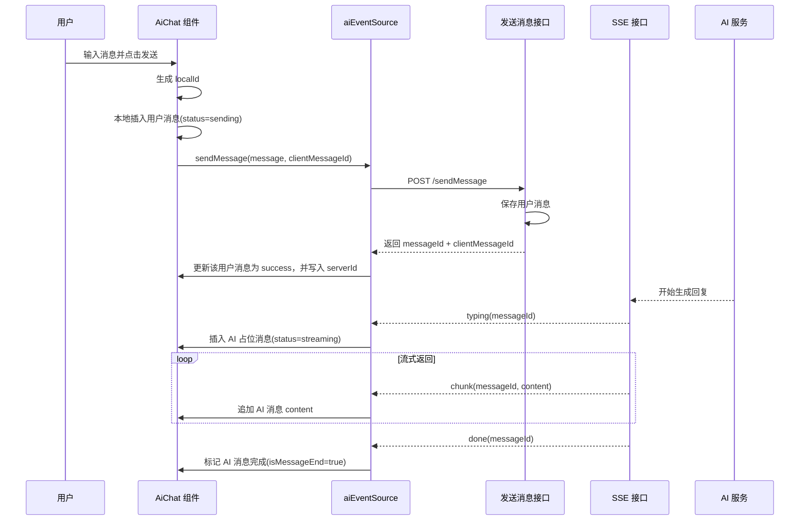
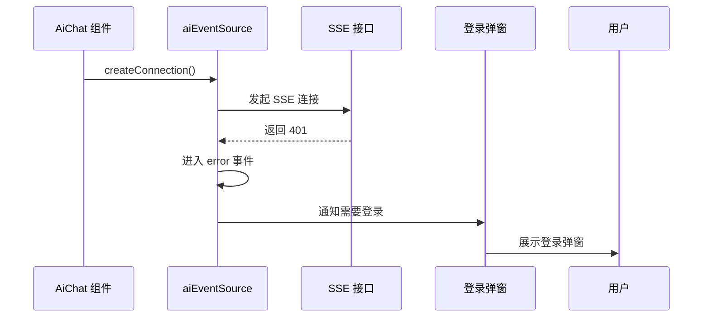
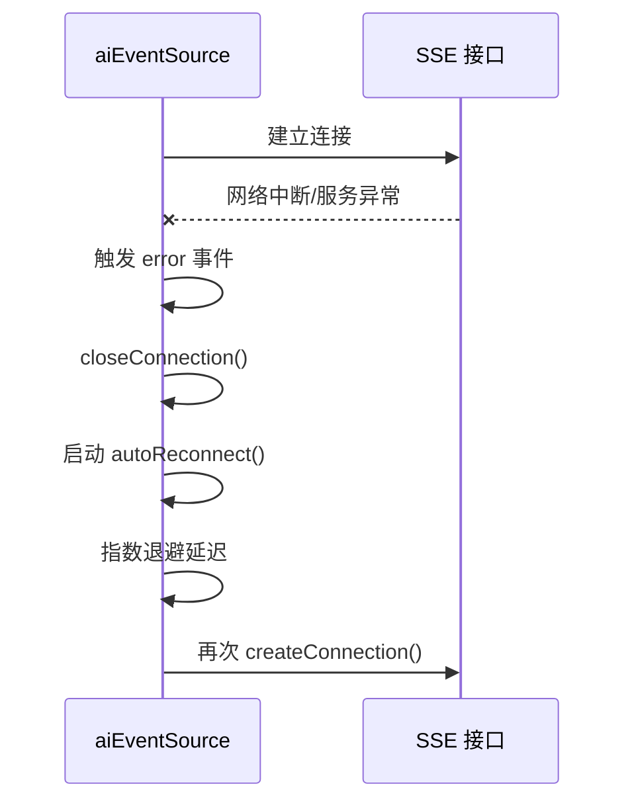
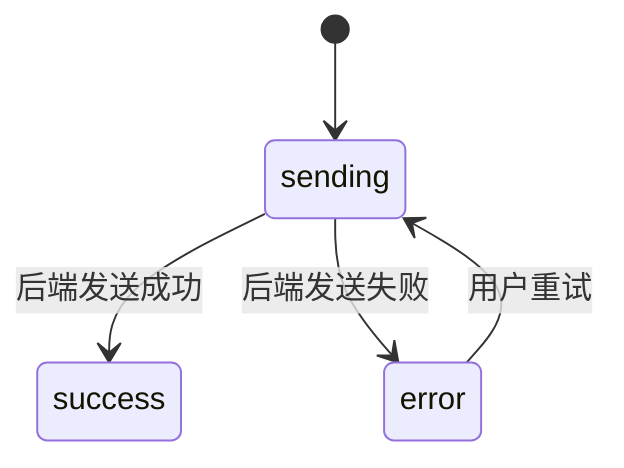
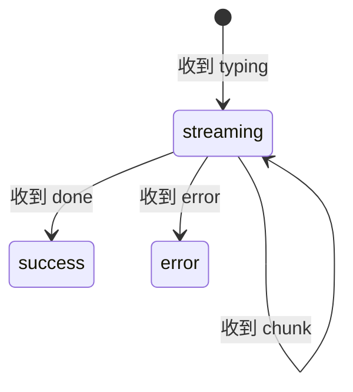

# AI 聊天消息流转设计文档

## 1. 文档目标

本文档用于说明 AI 聊天场景下，前端消息、后端消息、SSE 流式返回、消息 ID 映射以及登录态校验的整体设计流程。

适用范围：
- 前端 `AiChat` 组件
- 前端 `app/utils/eventSource.ts`
- 后端消息发送接口
- 后端 SSE 推送接口

---

## 2. 设计目标

### 2.1 核心目标

- 用户发送消息后，前端可以立即展示消息
- AI 回复通过 SSE 实时流式返回
- 前端能够正确维护消息列表状态
- 支持前端临时消息 ID 与后端正式消息 ID 的映射
- 支持未登录状态下触发登录流程
- 支持 SSE 断线后的自动重连

### 2.2 设计原则

- **前端本地状态优先**：保证聊天 UI 立即响应
- **后端正式 ID 负责持久化**：数据库主键和业务追踪由后端控制
- **消息流式更新**：AI 回复采用 chunk 增量更新
- **单向数据流**：SSE 推送消息后统一进入前端消息数组
- **明确状态管理**：区分发送中、流式中、完成、失败等状态

---

## 3. 消息 ID 设计

## 3.1 为什么需要两类 ID

在聊天场景中，通常不建议只依赖后端 ID。

原因如下：
- 用户点击发送后，前端希望立即渲染消息
- 后端响应和 SSE 返回存在网络延迟
- 前端需要能标记某条消息的发送中、失败、成功状态
- 失败重试时，需要定位本地是哪一条消息

因此通常采用两类 ID：

### 3.1.1 前端本地 ID

用于前端本地状态管理：
- React 列表渲染 `key`
- 乐观更新
- 发送中状态
- 失败重试
- 本地消息定位

推荐字段：`localId`

### 3.1.2 后端正式 ID

用于后端业务和持久化：
- 数据库存储
- 消息记录查询
- SSE 流式消息归属
- 多端同步
- 日志审计

推荐字段：`serverId` 或 `messageId`

## 3.2 是否要求前后端 ID 相同

不要求相同，但必须能建立映射关系。

推荐方式：
- 前端发送消息时携带 `clientMessageId`
- 后端处理成功后返回 `messageId`
- 同时把 `clientMessageId` 原样返回
- 前端据此完成映射

---

## 4. 推荐消息结构

## 4.1 前端消息结构

```ts
interface ChatMessage {
  localId: string;
  serverId?: string;
  role: 'user' | 'assistant' | 'system';
  content: string;
  isMessageEnd: boolean;
  createdAt: number;
  status?: 'sending' | 'success' | 'error' | 'streaming';
  errorMessage?: string;
}
```

字段说明：
- `localId`：前端本地唯一 ID
- `serverId`：后端正式消息 ID
- `role`：消息角色
- `content`：消息内容
- `isMessageEnd`：是否已接收完成
- `createdAt`：创建时间
- `status`：消息状态
- `errorMessage`：失败原因

## 4.2 发送消息请求结构

```ts
interface SendMessageRequest {
  clientMessageId: string;
  message: string;
}
```

## 4.3 发送消息响应结构

```ts
interface SendMessageResponse {
  clientMessageId: string;
  messageId: string;
  success: boolean;
}
```

## 4.4 SSE 推送消息结构

```ts
interface SSEMessage {
  type: 'connected' | 'typing' | 'chunk' | 'done' | 'error';
  messageId: string;
  content?: string;
  createdAt?: number;
  code?: number;
  errorMessage?: string;
}
```

---

## 5. 整体时序流程

## 5.1 正常消息发送流程



---

## 5.2 未登录流程



说明：
- EventSource 的 `error` 事件本身无法直接拿到 HTTP 状态码
- 如果业务上必须区分 401，推荐以下两种方式之一：
  1. 连接失败后，用额外的请求检查登录态
  2. 服务端不直接返回 401，而是通过 SSE 推送自定义错误消息

推荐优先级：
- 如果能改服务端：优先使用 SSE 自定义错误消息
- 如果不能改服务端：使用额外接口检查登录态

---

## 5.3 断线重连流程



### 指数退避示例

- 第 1 次：1 秒
- 第 2 次：2 秒
- 第 3 次：4 秒
- 第 4 次：8 秒
- 第 5 次：16 秒

建议设置最大重连次数，避免无限重试。

---

## 6. 前端状态流转设计

## 6.1 用户消息状态流转



## 6.2 AI 消息状态流转



---

## 7. 推荐的职责拆分

## 7.1 AiChat 组件职责

负责：
- 输入框交互
- 提交表单
- 展示消息列表
- 监听 `aiEventSource` 消息更新
- 根据未登录状态弹出登录框

不负责：
- SSE 连接细节
- 消息流 chunk 拼接
- 重连策略实现

## 7.2 aiEventSource 职责

负责：
- 创建和关闭 SSE 连接
- 自动重连
- 解析 SSE 数据
- 更新消息数组
- 对外通知消息变化

不负责：
- 直接渲染 UI
- 登录弹窗显示逻辑

## 7.3 后端职责

负责：
- 校验登录态
- 保存用户消息
- 返回正式消息 ID
- 调用 AI 能力
- 通过 SSE 推送 AI 回复流

---

## 8. 推荐的数据更新方式

当前你的 `eventSource.ts` 中已经有：

```ts
onUpdateMessage: (_messages: ChatMessage[]) => void = () => {};
```

这种方式适合当前项目，属于“回调通知”模式。

推荐更新流程：
1. `handleMessage()` 内更新 `messageArr`
2. 更新完成后调用 `onUpdateMessage([...this.messageArr])`
3. `AiChat` 中通过 `setMessages()` 同步到 React 状态

注意事项：
- 建议传递数组副本，而不是直接传原数组引用
- 原因是 React 更容易识别状态变化

推荐写法：

```ts
this.onUpdateMessage([...this.messageArr]);
```

而不是：

```ts
this.onUpdateMessage(this.messageArr);
```

---

## 9. 推荐的完整消息流转

## 9.1 用户发送消息

1. 用户在输入框输入消息
2. 前端生成 `localId`
3. 前端立即插入一条用户消息，状态为 `sending`
4. 前端调用发送消息接口，并携带 `clientMessageId`
5. 后端返回 `messageId`
6. 前端根据 `clientMessageId` 找到本地消息，写入 `serverId`
7. 同时将该消息状态改为 `success`

## 9.2 AI 流式回复

1. 后端开始生成 AI 回复
2. SSE 先推送 `typing`
3. 前端创建一条 AI 占位消息
4. SSE 连续推送 `chunk`
5. 前端不断拼接 `content`
6. SSE 推送 `done`
7. 前端将该 AI 消息标记为完成

## 9.3 发送失败

1. 用户消息发送接口失败
2. 前端找到对应 `localId` 的消息
3. 把状态改为 `error`
4. UI 提供“重试发送”入口

## 9.4 连接失败

1. SSE 连接失败触发 `error`
2. 如果确认是未登录，则弹出登录框并停止重连
3. 如果是网络错误，则进入自动重连

---

## 10. 推荐的落地方案

结合你当前项目，推荐按下面方式落地：

### 10.1 用户消息

- 前端生成 `localId`
- 先插入本地消息
- 调用发送接口时携带 `clientMessageId`
- 后端返回正式 `messageId`
- 前端建立 `localId -> serverId` 映射

### 10.2 AI 消息

- 完全使用后端 SSE 推送的 `messageId`
- `typing` 时插入占位消息
- `chunk` 时更新内容
- `done` 时结束消息

### 10.3 消息同步

- 保留 `aiEventSource.messageArr`
- 通过 `onUpdateMessage` 把消息同步给 `AiChat`
- `AiChat` 中维护 `messages` 状态用于渲染

### 10.4 登录态处理

- SSE 连接失败时不要盲目一直重连
- 需要先区分：是未登录还是网络异常
- 如果是未登录，应停止重连并引导用户登录

---

## 11. 总结

本方案的核心结论如下：

- 聊天消息不一定只使用后端 ID
- 前端临时 ID 和后端正式 ID 不需要相同，但必须能映射
- 用户消息适合“前端先渲染，后端再确认”
- AI 消息适合“后端生成正式 ID，通过 SSE 流式推送”
- SSE 消息数组更新推荐通过回调同步到 React
- 未登录状态需要单独处理，避免无意义重连

---

## 12. 后续建议

建议下一步继续补充以下内容：

1. 明确 `ChatMessage` 最终字段结构
2. 为用户消息增加 `localId` 和 `status`
3. 让发送接口支持 `clientMessageId`
4. 为未登录场景增加统一回调
5. 在 `AiChat` 中补充消息列表 UI 渲染逻辑
